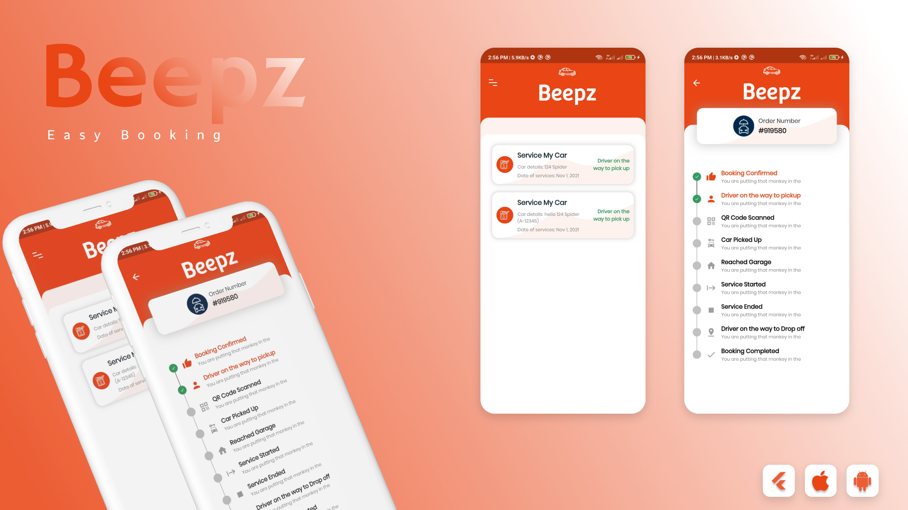

 <br>
<br/><br/>
<br><br>
# .
### Screenshots:
<br>
<table>
  <tr>
    <td></td>
    <td></td>
  </tr>
 </table>


## Project Environment:
```
Flutter 2.10.2 • channel stable
Dart 2.16.1
Visual Studio Code 1.66.2
Postman 9.14.14
```

